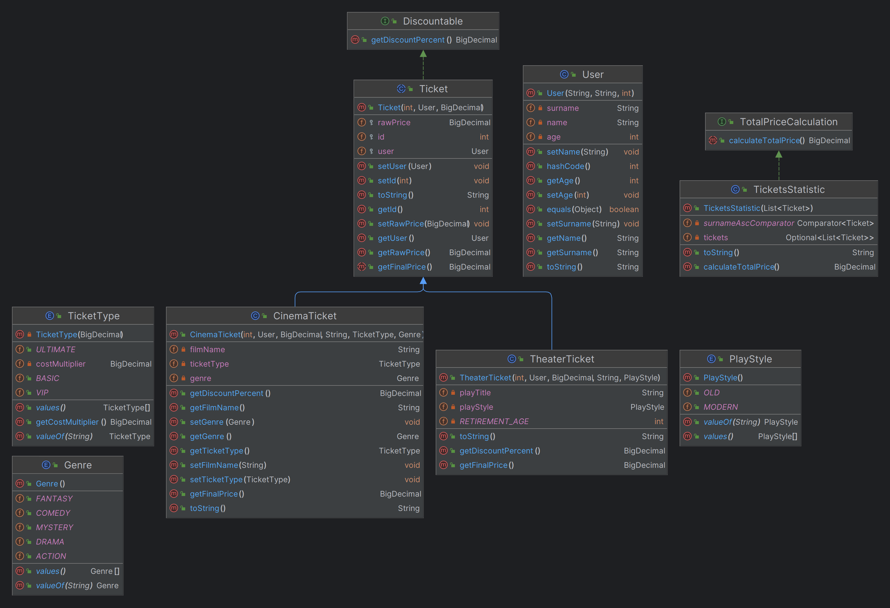
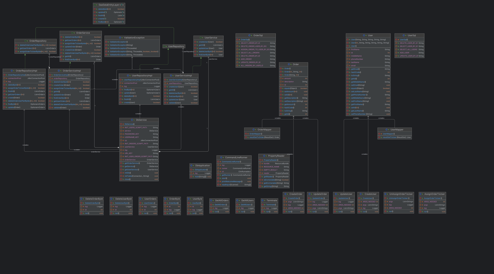
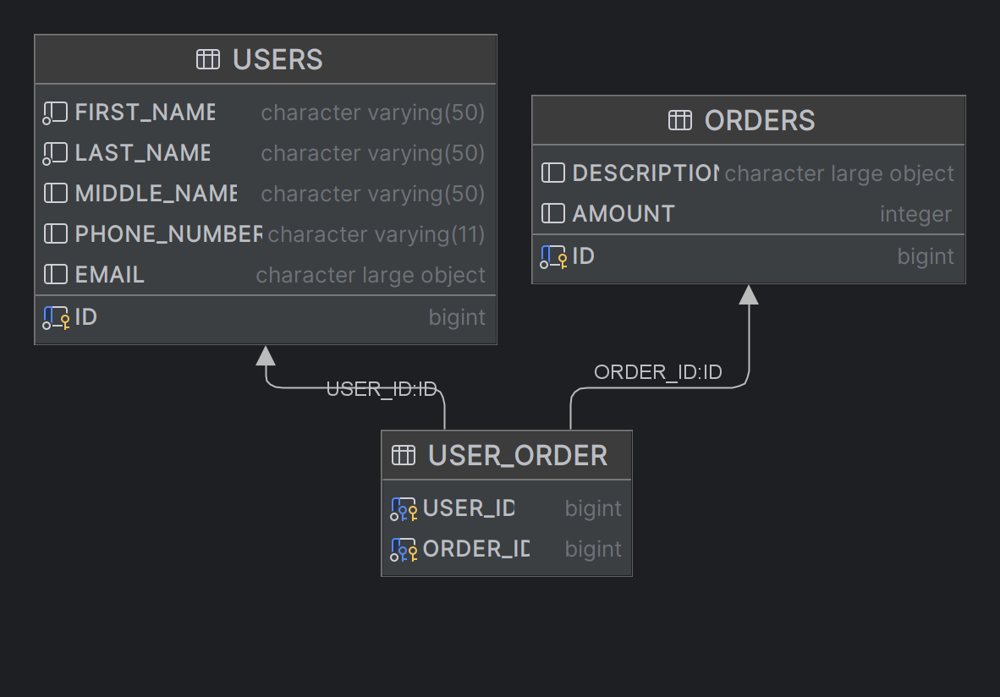

# Intensive-34 tasks:
 

Task 1

Предметная область - Сервис продажи билетов кино \ театр.

 

Task 4

Сделал консольный раннер для взаимодействия с бд.
Используется airline cli, можно вызвать help для списка команд.

Стоит вводить команду и аргументы без указания api, как в помощи - не знаю зачем оно так показывает.

Диаграмма классов:

Точка входа - DbApplication.java . Она запускает консольный раннер.
В тестах он не используется.

Главный класс - DbService. От него уже создаются репозитории с передачей туда пула соединений. Синглтон.
Собственно, он и используется в тестах. Всё что связано с cli я не тестировал, т.к. сделал на скорую руку,
чтобы было оправдано использование пула соединений.

Базовый DAO интерфейс - DaoDataEntityLayer. От него расширяются уже уникальные интерфейсы для каждых "энтити".

В самом низу диаграммы - команды раннера, на них можно не обращать внимания. 
Основная информация - ближе к верхней части.

Также реализована некая обертка над ресурс бандлом, чтобы можно было читать из пропертей строки вида ${VAR_NAME:DEF_VALUE}.
Пытается взять ситемную переменную, если не находит, то возвращает DEF_VALUE.

Схема БД:

Таблица для юзеров, таблица для заказов и двусторонняя join таблица для связей между ними.
Имеет композитный Primary Key (userId, OrderId), что гарантирует уникальность пар.

Именно она юзается для join запроса по тз домашки для отображения всех заказов конкретного пользователя.

Скрипты инициализации разбил:
* Юзеры [initUsers.sql](src/main/resources/sql/initUsers.sql)
* Заказы [initOrders.sql](src/main/resources/sql/initOrders.sql)
* Юзеры_заказы [initUserOrder.sql](src/main/resources/sql/initUserOrder.sql)
Для генерации id используются последовательности.

Тесты:
Выполняются поочередно, перед запуском необходимо снести базу с диска. База создается
в папке db. Имя - test(берется из пропертей).

